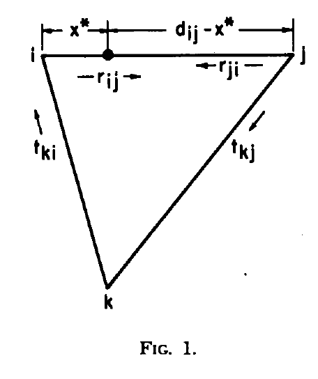
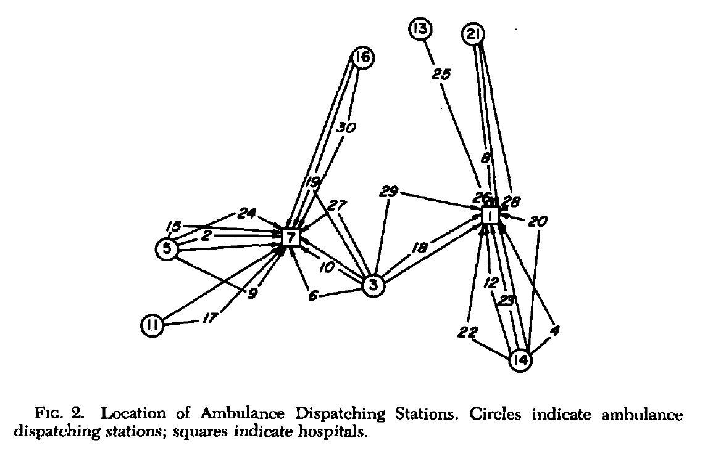
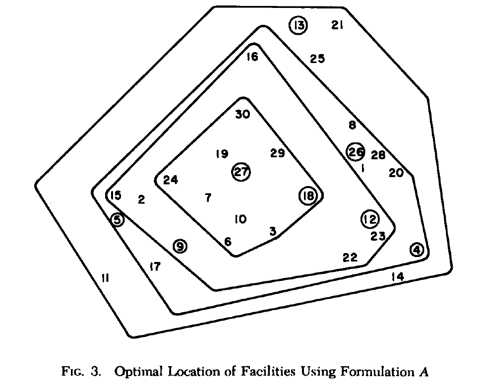
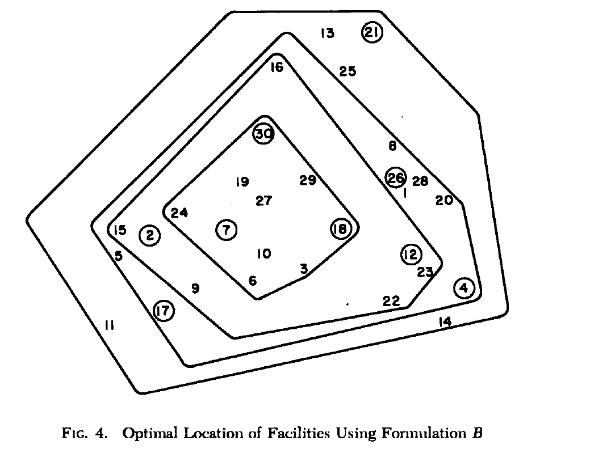
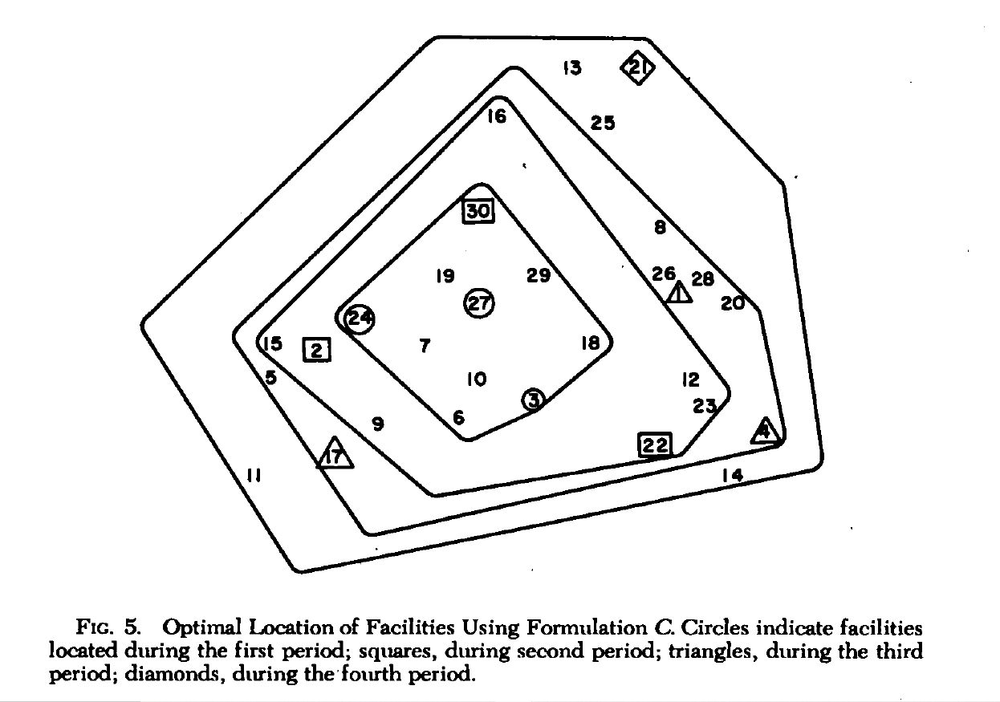

集合覆盖问题的应用
[[TOC]]

***

# 前言   

本文将集合覆盖问题扩展到三种新的场景：
1. 假设需求沿网络的弧线连续发生
2. 移动设备从备选地点之一出发，获取需求，并在更远距离的点提供服务
3. 随着时间的推移，会出现新的需求和地点
在较早的文献中，Toregas 和 ReVelle[4]阐述了如何将特定的设施选址问题构建为集合覆盖问题。 
这项工作表明，**reduction techniques** 可以可靠地解决许多这种形式的问题。本文将通过几个不同的选址问题来检验一些方法，这些选址问题可以使用最大服务时间的概念构造为集合覆盖问题。
基本模型是从网络上的指定站点中选择最少设施数量的位置，以确保每个用户在s时间单位内到达一个设施。
在这里，用户的概念被扩展为，既包含弧也包含节点。为了构建这个模型，我们需要以下定义： 
$$P = (1,2,...,m) = 需要服务的节点或弧的集合$$
$$J = (1,2,...,m) = 作为潜在设施站点的节点集$$
$$t_jp = 从j节点到用户p最远距离节点的最短时间$$
$$s = 最大服务时间$$
$$x_j = 如果一个设施在j中则为1，否则为0$$
我们现在可以为用户$p$定义一个服务子集$N_p$，该集合的元素是节点$j$，即服务于用户$p$的设施选址的候选集：这个集合
$N_p$中的每一个成员$j$,必须能够在$s$单位时间内到达用户$p$的最远距离点。当用户p是一个节点时，最远距离的点就是该节点本身。
$$N_p=(j \in J|t_jp \leq s) \quad for \  all \ p \in P $$
我们现在可以构造出如下的基础模型：
$$min\sum_{j\in N_p} x_j, $$
约束为：
$$\sum_{j\in N_p} x_j\ge1 \quad for \  all \ p \in P$$
$$x_j = (0,1) for \  all \ j \in J$$

对于这个集合覆盖问题的一个最优的解决方案将给我们提供可以服务所有用户$P$并且仍然确保整个系统的最大服务时间为S单位时间的最少数量的设施位置。
在分析的这一问题时，需要注意考虑到这个最大服务时间s是他想考虑的唯一一个条件，决策者只会有”一个“ 最优解决方案，这种情况很难和实际中的决策一致。如果能够向决策者呈现各种对应着最大服务时间表示的不同的效用水平的最优解决方案，则更接近于现实情况。
前面的公式为接下来的几个公式奠定了基础，本文将说明如何做出微小的改变，以适应一组有趣的规则问题。
“reductions”方法被用来求解例子，在[4]中有详细描述。
# 弧覆盖公式

在之前的一篇论文[4]中，假定服务需求集中在空间中的点上。虽然这种假设在分析的规模很大的时候可能是充分的，但是当这些需求的人口变得连续时，它就开始失效了。一个例子可能是人口沿着街道存在的环境。一个
接受来自连续网络的服务需求并同时产生集合覆盖问题的模型现在被构建。 
假设一个弧线网络，沿着弧线存在服务需求，我们的目标是找到设施的最少数量以及这些设施的位置，以便网络上每条弧线上的所有需求都能在$s$单位时间内找到设施。我们将做出额外的限制，为了可以覆盖一个弧线，每个潜在设施的位置必须能够服务于弧线上的所有点。也就是说，一个弧线由两个设施联合覆盖是不够的，除非其中一个设施单独就能覆盖弧线。 
如果给定对称的距离矩阵$D$,其中矩阵元素$d_{ij}$
表示节点$i$和$j$之间的地理距离，则弧线网络可以被定义。请注意，当节点$i$和$j$之间不存在弧时，
对应的元素$d_{ij}$ 和$d_{ji}$ 将是无限的（或M,其中M是一个足够大的数字）。现在引入弧上两个节点之间在某一个方向上的旅行时间的概念。一个数量指标是速度的倒数$r_ij$,它表示从$i$到$j$每经过一单位长度的时间。请注意，在这种一般处理中，我们允许$r_{ij}$ 和$r_{ji}$ 是不同的,从而接近现实世界的条件。在现实世界中，由
系统的地理，环境，和交通条件施加的限制可能会产生不对称的旅行时间矩阵。现在很容易创建一个旅行时间矩阵
$T^{'}$,它的元素$t_ij$表示从节点$i$到
$j$之间的旅行时间。
$$t_{ij}^{'}=(d_{ij})(r_{ij}),$$
利用这个旅行时间矩阵$T^{'}$，我们可以推导出一个包含元素$t_{ij}$的最小的旅行时间矩阵$T$,它将给出一个节点与网络中沿现有弧线的所有其他节点的最小旅行时间。**Floyd算法**被用于当前问题的分析。
对于一致性问题（$1$）,我们通过索引$p$定义每一个网路中的双弧线（$ij$）.现在我们将定义节点$k$为弧p的覆盖，其中沿着这条弧的所有点到达节点$k$的时间可能小于时间一些预定义的最大响应时间。然后我们搜索对于每一次这样的弧$p$在所有其他节点的网络去寻找那些满足这个需求，然后形成这个弧的服务子集$N_p$。一旦为网络的所有弧线生成了这样的子集，那么标准覆盖公式（$1$）可以应用于这个弧线覆盖问题。注意，当，$arc(ij)=arc(ji)$ 时,我们只需要用一个$p$ 对弧编号
因为$p$ 指的是相同的弧 $(i,j)$.
为了高效地创建子集$N_p$,有必要定义弧$p$上的$k$-等时点为从点$k$使用节点$i$和$j$作为圆弧$p$的入口点，可以在相同的时间内达到的点。图1展现了问题的几何形状，假设$x^*$ 是$k$ -isotim点，用距离节点$i$的时间单位来度量。 
从它的定义来看 $x^*$ 必须满足这个关系：
$$t_{ki}+x^*r_{ij}=t_{kj}+(d_{ij}-x^*)r_{ij}\quad (1)$$
  
求解$x^*$ ,得：
$$x^* = \frac{t_{kj}-t_{ki}+d_{ij}r_{ji}}{ r_{ij}+r_{ji}}\quad (2)$$

弧 $p$ 上 $x^*$ 左边的所有点都可以通过节点 $i$ 到达，$x^*$ 右边的所有点可以通过节点$j$到达. 现在我们可以对节点$k$对弧$p$的覆盖能力做如下描述：若
$$t_{ki}+x^*r_{ij}\le s, $$
那么节点$k$将是弧$p$的覆盖，注意，如果这个条件成立，那么根据 $x^*$ 的定义，
$$t_{ki}+(d_{ij}-x^*)r_{ij}\le s, $$
则弧上的所有点离节点$k$的距离都在s单位时间内
代入 $x^*$ 的定义，第一个不等式可以改写为最终的检验方程：
$$\frac{r_{ij}}{r_{ij}+r_{ji}}t_{kj}+\frac{r_{ji}}{r_{ij}+r_{ji}}t_{ki}+\frac{r_{ij}r_{ji}}{r_{ij}+r_{ji}}d_{ij} \le s.$$
这个不等式足以测试所有可能的节点作为给定弧线的潜在覆盖。然而，为了缩短计算和执行时间，可以发现，初步简化为更简单的条件。可以看出，
如果
$$t_{ki}\gt s$$
或
$$t_{kj}\gt s$$
则节点$k$不可能覆盖弧$p$,因为$t_{ki}$ 和$t_{kj}$ 是最小旅行时间，如果满足这些条件之一，那么存在至少一个点（弧的终点），无法从节点k找出覆盖。如果一个节点$k$通过这些初始测试，那么可以得到最终的测试方程（5）来确定节点k是否覆盖整个弧。 
所有的节点都被检查为每条弧的潜在覆盖。然而如果弧的数量很大，这个步骤可能是低效的。可以设计一种启发式程序，对每条弧 $(i,j)$ ,丢弃网络中显然不可能作为覆盖对象的部分。但就目前而言，两个端点条件约束的效率似乎执行时间相当低，即使是对于大型网络。
对于arc-covering公式，通过连接30-node网络的节点（5）创建了50和90弧的两种配置。弧长所使用的距离对应了最小的节点到节点距离，经过
100倍的缩放后四舍五入到最近的整数，以简化解决方案的图示表示。在处理这类问题的经验中，人们注意到，小于最大服务距离的某个值，就会发生不可行的情况。这一事实可以用问题定义阶段的约束来解释，该约束限制每个圆弧在距离任一点不超过$s$个单位时间的地点中选择一个设施地点。
由于在我们的分析中，设施被限制在网络的节点上，最长的弧的长度对解决方案施加了可行性约束；任何小于这个长度的$s$值都会使至少一条弧线无法覆盖。

这些结果是在两个方向使用沿所有弧的单位速度得到的（即$r_{ij}=r_{ji}=1,对于所有的i和j$）;使用不等速度进行的执行没有产生额外的问题，并被常规地解决。

# 救护车站选址问题

在前面的分析中，最大响应时间（或最大服务时间）是从服务器所在的点到需求点（或反之亦然）测量的。服务要么假定发生在需求点，要么假定个人直接前往服务设施。然而这种方法缺乏对救护车服务进行分析的一个关键因素，因为最大响应时间必须包含从救护车站到需求点的时间加上从需求点到医院（最终提供服务的医院）的
时间。 
因此，可以对问题设置和公式进行轻微的修改,包括救护车位置。假设存在一个离散需求的n节点网络和有限的固定设施集合，代表每个需求给出最终服务的医院。让我们定义以下术语：
$$d_{jp}=从节点j到第p个user(这个例子中的需求点)的最短时间$$
$$h_p=从第p个user到离他最近的医院的最短时间$$
$$d_{jp}+h_p=从一个节点j的救护车到第p个user再到离他最近的医院的最短时间$$
$$N_p=(j|d_{jp}+h_p \le s)=从一个集合中的任意一个节点j离开的救护车到第p个user再到离他最近的医院的最短时间在s时间（或距离）内的节点集合$$

现在，问题设置可以被构建为这样一个结构：一个移动单位前往需求点，接受个人寻求的服务，并前往最终提供服务的最近设施。在这个设定中，人们寻求
在任何需求点的个人等待时间不会超过在固定设施服务的最大允许时间的最小数量的被派遣的出发点。利用所提出的定义，救护车调度问题与公式（$1$）相同。注意,由于$h_p$ 通常是不相等的，因此约束矩阵将是不对称的。 
在救护车位置公式的最大距离范围内扫描了两个示例问题；第一个假设存在节点1和节点7两家医院，而第二个假设存在5家医院。这两种情况的目标都是确定救护车调度站的最小数量，以便确保每个节点都有一辆救护车能够到达那里，并在规定的最大响应时间内将患者送到最近的医院。在之前的公式中引入30个节点的网络（5）也被用于这两个问题的设定。图2为两家医院的案例，展示了覆盖模式的一个例子。
  
# 计划阶段的扩展

到目前为止，我们所关注的基本模型在时域是静态的；即需求节点和潜在站点随时间变化是固定的，不考虑时间变化。然而，这个问题的规划范围可以扩展，以确定
当前和未来服务需求的最佳设施选址。
为了扩展规划视界问题，开发了三个模型：每一个模型在服务需求的未来预测的确定性以及潜在地点的可用性方面都有所不同。将采用下列新定义。设$t$是一个时间段下标，范围从$0$（当前时间段）到某个*有限阶段* $T$ ,$P_t$是时间段$t$内可供选址的潜在设施站点集合。我们将假设任意时刻$t$的用户集和设施集，除了新成员
外，每个都包含了$t-1$时刻对应集合的所有元素。随时间的推移，允许$P_0(P_1(...P_T和J_0(J_1(...J_T$扩展，但用户和供应节点集和不会收缩。
现在我们将介绍三个扩展的阶段模型，其顺序将反映作为决策基础的可用信息的确定性的下降。
## A.关于未来可用模式的全部信息

让我们假设未来服务需求的增长模式是精确已知的（即决策者对最终需求集$P_T$有一个准确的预测）,还假设所有潜在设施选址在时间段为0时都是可用的；即$J_T=J_0$。我们感兴趣于用最少的总设备来满足阶段需求。 
然后，已知增长模型的最佳设施位置将由公式（$1$）的解给出。所有现在和未来的用户都要求覆盖；也就是说，集合$P_T$中的所有成员都必须被覆盖。 
考虑到求解这个问题的结果，需要注意，不是所有最优位置的设施都必须在最初的时间段内建造。在每个时间段内，选择只建造那些为这一期间产生的新需求服务而需要的设施。在一段时期内选择建造哪些设施似乎可以通过解决另一个设定问题来实现。每个时期内的问题将包括当时存在的需求，加上从上一个问题的最佳解决方案所提供的地点列表中提取的地点。这样，设施的建设将遵循需求的增长模式，但最终的空间布局将是在整个规划范围内的最优布局。

## B.有限的场地可用性

在分析开始时，$P_T,J_T$ 已知。但现在让站点可用性受到限制。这种限制可以通过以下要求来施加：除非站点周围区域产生足够的服务需求，否则站点不可用。如果放宽这一限制，可以选择利用率相对较低的设施。使用这样的需求，我们将不得不重新制定服务集$N_p$,使用一种面向时间的方法来表达这样一个事实，即不是
所有$JT$的成员都可以在任何给定的时间段$t$是可用的。定义：
$$N_p=(j \in J_q|t_jp \le s)\quad for \ all \ p,$$
其中$q$是需求$p$产生的时间段。想要解决这个有扩展规划范围的受限版本的集合覆盖公式与公式（1）相同。

## C.增长模式的完全不确定性

如果需求的增长模式和潜在地点的可用性在未来的某个时期之前是完全未知的，那么我们在每一个这样的时间段开始时都会面临一个新的选址问题。然而，每个时间段的决策都会影响到后续时间段的决策。因此，在每一时期之后，人们必须考虑在之前所有时期建造的设施的位置，以适应日益增长的需求。这一信息很重要，因为较早时期的分配可能会满足较晚时期出现的需求。
为了在不确定的规划范围内定位设施，我们必须解决一系列$T$集合覆盖问题；对于每个时间段$t$，我们将构造并解决以下问题：
$$min \sum_{j \in J_t}x_j,$$
限制条件：
$$min \sum_{j \in J_t}x_j \ge1 \quad for \ all \ p \in P, $$
$$x_j = 1 \quad for \ all \ j \in J_t, $$
$$x_k = 1 \quad for \ all \ k \in R_t, $$
其中$R_t$是在时间周期0,1,...t-1已经被分配设施的站点集合， 且R_0是空集。在第$T$次循环的答案，将是这个需求增长不确定的阶段模型的解。 
关于未来需求信息与所需设施数量之间关系的30个节点的网络得到了直观的结果。在整个分析过程中使用了70个距离单位的固定最大服务距离，并将其分解为四个不同的时间段。每个时间段开始时假设存在的用户为：
$$P_1 = (3,6,7,10,18,19,24,27,29,30)$$
$$P_2 = (P_1,2,9,12,15,16,22,23)$$
$$P_3 = (P_2,1,4,5,8,17,20,26,28)$$
$$P_4 = (P_3,11,13,14,21,25)$$
在这个简化的例子中，只有需求点的设施位置是可用的。 
第一个公式假设对未来需求有完全的了解，以及在第一阶段开始时，所有节点选址设施的可用性；包括那些需求直到较晚时间才出现的节点。
由此产生的集合覆盖的问题得到了解决，并得出最优设施数量为8个。它们的位置如图3所示，如前所述，这些设施将不会被安排建造，直到它们被要求提供覆盖的时间。

第二个公式构造了相同的问题，但增加了一个限制，即未来需求的地点不能作为设施的地点，满足较早时发展的需求。未来的需求是可以满足的，但只能通过在需求已经形成的场址建设设施来满足。由此产生的设定问题给出了所需设施的最佳数量9个，它们的配置如图4所示。

第三个公式假设在每个时间段都完全不知道未来的需求。在每个时间段，现有的需求必须通过在节点的一个子集中放置设施来满足，事实上就是那个时期提出需求。因此每一个连续的时间段不仅有新的未被满足的需求作为输入，而且还有在前一时间段分配的设施的位置。这个问题的最优答案是10个设施，它们的位置如图5所示。

这些结果虽然是针对需求节点的特定配置得出的，但支持了这样一个直观的概念，即在这种时间依赖的位置问题中，设施的最佳数量与分析开始时可用的信息量
成反比。现在对阶段需求的了解越多，在选择每个设施的选址选址时给与的自由度越大，最终选址模式的效率就越高。也就是说，随着时间的推移，越需要更少的设施来实现所需的覆盖范围。 
然而，这个直观的结果可能会产生误导。虽然结果支持对问题的全面分析，但在预测未来需求的地点和时间方面可能会出现错误。这样的错误可能会抵消使用一个允许自由定位并提供未来信息的模型所获得的收益。因此，虽然为远景规划而不是每次为一段时间规划的主张很有吸引力，但信息缺陷将影响规划的成功。 
在面对不确定的未来时，可以采用两种策略对阶段进行规划。一种是检查交替但可能发生的未来的发展模式。通过观察**交替发展模式**中覆盖所需要的设施的数量和位置，可以确定在几种情况下提供有效覆盖的解决方案。 
另一种可能是假设每个地点的发展规模是一个随机变量。当然，一个分布必须附加到每个需求点的开发水平，这在概念上不是一件容易的任务。尽管如此，承认不确定性是重要的一步。在$s$个单位时间内实现所有需求的最少设备数量的简单设定将不再满足。相反，Church和ReVelle[2]最近的模型框架将更适用。
该模型被称为“最大覆盖选址问题”。它试图定位设施，以在设施的规定时间内实现人口的最大比例；可以放置的设施数量被限制在一个特定的数量。在目前的
情况下，对时间的需求将是随机变量。我们没有指出该模型将如何应用的精确细节，因为我们目前不知道如何构建这样一个问题。然而，在这里提到这个模型，
是为了表明它的目标，最大的人口覆盖，在服务于未来但可能需求被错误估计的背景下，可能是一个很好的目标。在此背景下，一个最近由Carbone[1]提出的基于概率的p-中值模型可以应用。这个模型最小化了用户的“期望”平均距离。
